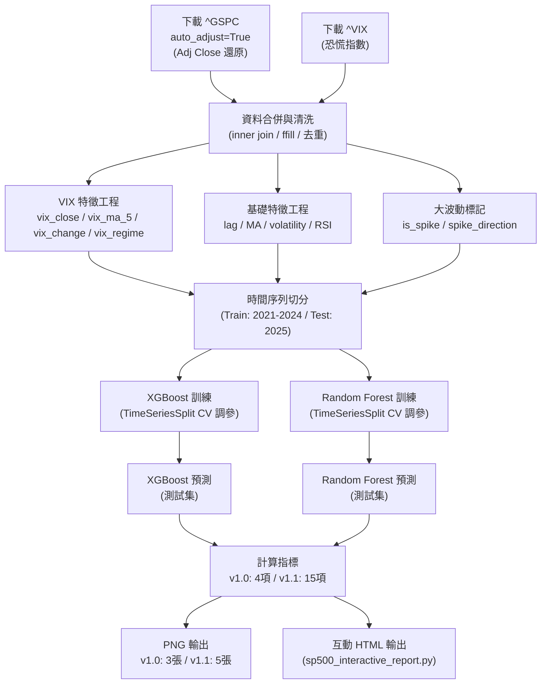

# AI 代理人實作計畫書
## S&P 500 指數預測系統

**版本**：v1.1（修訂：加入股利還原、VIX 特徵、詳細報告、互動 HTML）
**日期**：2026-03-27
**撰寫人**：AI 代理人
**審核人**：專案經理

---

## 學術倫理承諾聲明

1. **嚴禁預知偏差（Look-ahead Bias）**：任何模型在訓練時，絕對不得接觸到 2024-12-31 之後的資料。
2. **嚴禁隨機洗牌**：所有資料切分必須依照時間順序進行。
3. **嚴禁資料洩漏（Data Leakage）**：特徵工程的統計量只能基於過去資料計算。
4. 測試集（2025 年全年）僅用於最終評估，不參與任何訓練或超參數調整。

---

## 一、資料獲取與前處理

### 1.1 資料來源

| 項目 | 說明 |
|------|------|
| 套件 | `yfinance` |
| 主標的 | `^GSPC`（S&P 500 指數） |
| 輔助標的 | `^VIX`（CBOE 波動率指數） |
| 時間範圍 | `2021-01-01` 至 `2025-12-31` |
| 主要欄位 | Open、High、Low、Close、**Adj Close**、Volume |

### 1.2 股利還原股價（Dividend Adjustment）

S&P 500（`^GSPC`）為**價格報酬指數**，成分股發放股利時，指數會出現非真實跌幅。

**處理方式：**
- 使用 `yfinance` 的 `auto_adjust=True`，自動以 Adj Close 取代 Close
- `Adj Close` 已向前回溯還原所有除息、除權影響，確保歷史序列的連續可比性

```python
gspc = yf.download("^GSPC", start="2021-01-01", end="2025-12-31", auto_adjust=True)
# gspc["Close"] 即為已還原的 Adj Close
```

> ⚠️ `auto_adjust=True` 的回溯調整使用截至下載當日的最新調整因子，此為業界慣例，不構成 Look-ahead Bias。

### 1.3 資料品質處理

| 問題 | 處理方式 |
|------|---------|
| 缺失值（假日、停市） | 前向填補（ffill）後向填補（bfill） |
| VIX 與 GSPC 日期不對齊 | 以 GSPC 交易日為基準進行 inner join |

### 1.4 特徵工程（共 18 個特徵，防止資料洩漏）

所有特徵均為落後型，確保特徵值 $F_t$ 只使用 $t$ 以前的資料：

#### 基礎特徵

| 特徵 | 計算方式 | 說明 |
|------|---------|------|
| `lag_1/5/10` | AdjClose(t-1/t-5/t-10) | 落後收盤價 |
| `ma_5/20/60` | 前 5/20/60 日移動均線 | 短/中/長期趨勢 |
| `volatility_10` | 前 10 日標準差 | 波動率 |
| `volume_change` | (Vol(t-1)-Vol(t-2))/Vol(t-2) | 成交量變化率 |
| `rsi_14` | 14 日 RSI | 技術指標 |
| `day_of_week` | 星期幾（0–4） | 週期效應 |
| `month` | 月份（1–12） | 季節效應 |
| `daily_return` | pct_change(1) | 日報酬率 |

#### 🆕 VIX 恐慌指數特徵

| 特徵 | 計算方式 | 說明 |
|------|---------|------|
| `vix_close` | VIX(t-1) | 前一日恐慌指數 |
| `vix_ma_5` | VIX 前 5 日均值 | 短期恐慌均線 |
| `vix_change` | VIX(t-1) pct_change | VIX 日變化率 |
| `vix_regime` | VIX(t-1) > 20 → 1 | 高/低波動機制（二元） |

#### 🆕 單日大幅波動標記（Spike Flag）

| 特徵 | 說明 |
|------|------|
| `is_spike` | abs(daily_return) > μ+2σ（訓練集統計） → 1 |
| `spike_direction` | +1（大漲）/ -1（大跌）/ 0（正常） |

**防洩漏規則**：μ 與 σ 只用訓練集（2021–2024）計算，套用至測試集時不重新計算。

### 1.5 預測目標

$$\text{Target} = \text{AdjClose}_{t+1}$$

---

## 二、模型開發策略

### 2.1 時間序列切分

```
完整資料集：2021-01-01 ～ 2025-12-31
    ├── 訓練集：2021-01-01 ～ 2024-12-31（約 945 個交易日）
    └── 測試集：2025-01-01 ～ 2025-12-31（約 248 個交易日）
```

> ⚠️ 2025 年任何資料不得出現在訓練集中。

### 2.2 XGBoost 超參數

| 參數 | 值 | 設定邏輯 |
|------|---|---------|
| `n_estimators` | 500 | 樹數量，配合 CV 尋找最佳值 |
| `max_depth` | 4 | 防止過擬合 |
| `learning_rate` | 0.05 | 較小學習率提升泛化性 |
| `subsample` | 0.8 | 增加多樣性 |
| `colsample_bytree` | 0.8 | 每棵樹使用 80% 特徵 |
| `reg_alpha / lambda` | 0.1 / 1.0 | L1/L2 正則化 |

### 2.3 Random Forest 超參數

| 參數 | 值 | 設定邏輯 |
|------|---|---------|
| `n_estimators` | 300 | 300 棵達到穩定集成 |
| `max_depth` | 6 | 獨立樹可允許略深 |
| `min_samples_split` | 20 | 防止過擬合 |
| `max_features` | `"sqrt"` | 標準設定 |
| `bootstrap` | True | Bootstrap 抽樣 |

### 2.4 時間序列交叉驗證

使用 `TimeSeriesSplit(n_splits=5)`，在訓練集內部進行超參數粗調：

```
Fold 5（最接近測試集）：Train [2021-01 ～ 2024-04] | Val [2024-05 ～ 2024-12]
```

---

## 三、評估指標

### 3.1 主要指標：MSE

$$\text{MSE} = \frac{1}{n}\sum_{i=1}^{n}(y_i - \hat{y}_i)^2$$

### 3.2 版本 1.0 輔助指標（4 項）

| 指標 | 說明 |
|------|------|
| RMSE | √MSE，與原始數值同單位 |
| MAE | 平均絕對誤差 |
| MAPE (%) | 平均絕對百分比誤差 |

### 3.3 🆕 版本 1.1 擴充指標（共 15 項）

在 3.2 的基礎上新增：

| 指標 | 說明 | 判讀 |
|------|------|------|
| 最大單日誤差 | 最壞情況誤差 | 越小越好 |
| 誤差標準差 | 誤差的穩定性 | 越小越好 |
| Q25/Q75/Q95 絕對誤差 | 分位數誤差 | 全面評估分佈 |
| 過估比例 | 預測高於實際的比例 | 系統性偏高診斷 |
| 低估比例 | 預測低於實際的比例 | 系統性偏低診斷 |
| 方向準確率 | 正確預測漲/跌方向 | >50% 優於隨機猜測 |
| 相關係數 r | 線性相關程度 | 1.0 = 完美 |
| 決定係數 R² | 模型解釋變異量 | 1.0 = 完美 |

### 3.4 版本 1.1 實測結果（2025 年測試集）

| 指標 | XGBoost | Random Forest |
|------|---------|---------------|
| MSE | **234,014** | 260,235 |
| RMSE (pt) | **483.75** | 510.13 |
| MAPE (%) | **5.74** | 6.31 |
| 最大誤差 (pt) | **923.9** | 945.2 |
| 方向準確率 (%) | 51.0 | **60.0** |
| R² | 0.577 | **0.719** |

---

## 四、視覺化計畫

### 4.1 版本 1.0 輸出（三張 PNG）

1. **預測對照圖**：實際值 vs. XGBoost vs. RF，大波動日標記紅色虛線
2. **VIX 雙軸圖**：S&P 500（左軸）+ VIX（右軸），VIX>20 陰影
3. **誤差折線圖**：每日誤差，大波動日標記

### 4.2 🆕 版本 1.1 輸出（五張 PNG）

在 4.1 的基礎上新增：

| 圖 | 內容 |
|----|------|
| **sp500_results_v1.1.png** | 三合一圖（含數值摘要框 + ±RMSE 水平線） |
| **sp500_report_v1.1.png** | 詳細報告頁（四象限 + 底部指標總表）：散點圖 / 誤差直方圖（含偏度峰度）/ CDF / 20日滾動RMSE |
| **sp500_feature_importance_v1.1.png** | 特徵重要性（每條長條末端標精確數值） |

### 4.3 🆕 互動式 HTML 報告（sp500_interactive_report.html）

| 功能 | 說明 |
|------|------|
| 圖表互動 | 6 張 Plotly 圖表，可縮放、平移、懸停查看精確數值 |
| 懸停說明 | 13 個術語（MSE/RMSE/MAE/MAPE/R²/方向準確率/XGBoost/RF/VIX/大波動/Adj Close/Look-ahead Bias/TimeSeriesSplit）在滑鼠移入時彈出說明框 |
| 指標摘要表 | 12 行比較表，勝出格以藍色底色標記 |
| 術語詞彙表 | 點擊按鈕開啟新視窗，完整中文定義，附列印功能（印出時自動切換白底） |

---

## 五、系統流程圖



---

## 六、應急預案

若測試集 MAPE > 5% 或 MSE 明顯偏高，依優先順序調整：

### 方案 A：擴充技術指標
新增 MACD、Bollinger Bands、ATR、OBV

### 方案 B：滾動訓練視窗（Walk-Forward）
每次用固定長度視窗訓練，向前滾動預測

### 方案 C：超參數重新調整
使用 `Optuna` 或 `GridSearchCV`（搭配 `TimeSeriesSplit`）在訓練集內搜尋

---

## 七、輸出檔案規劃

| 檔案 | 類型 | 產生方式 | 說明 |
|------|------|---------|------|
| `sp500_prediction.py` | Python | 手動 | 版本 1.0 主程式 |
| `sp500_prediction.ipynb` | Notebook | 手動 | 版本 1.0 互動版 |
| `sp500_prediction_v1.1.py` | Python | 手動 | 版本 1.1（詳細圖表） |
| `sp500_interactive_report.py` | Python | 手動 | 互動 HTML 報告產生器 |
| `sp500_results.png` | 圖片 | 自動 | 版本 1.0：三合一視覺化 |
| `sp500_feature_importance.png` | 圖片 | 自動 | 版本 1.0：特徵重要性 |
| `model_comparison.csv` | CSV | 自動 | 版本 1.0：4 項指標 |
| `sp500_results_v1.1.png` | 圖片 | 自動 | 版本 1.1：三合一（加強版） |
| `sp500_report_v1.1.png` | 圖片 | 自動 | 版本 1.1：詳細報告頁 |
| `sp500_feature_importance_v1.1.png` | 圖片 | 自動 | 版本 1.1：含數值標注 |
| `model_comparison_v1.1.csv` | CSV | 自動 | 版本 1.1：15 項指標 |
| `sp500_interactive_report.html` | HTML | 自動 | 互動報告（懸停說明 + 詞彙表）|
| `requirements.txt` | 文字 | 手動 | 套件清單（含 macOS brew 說明） |
| `README.md` | Markdown | 手動 | 新手操作指南（A/B/C 三種執行方式）|

---

## 八、技術環境需求

```
Python >= 3.9（建議 3.10 或 3.11）

【macOS 系統層級依賴（brew，非 pip，安裝一次即可）】
1. Homebrew（若尚未安裝）：
   /bin/bash -c "$(curl -fsSL https://raw.githubusercontent.com/Homebrew/install/HEAD/install.sh)"
2. OpenMP runtime（XGBoost macOS 必要依賴）：
   brew install libomp

【Python 套件（pip install -r requirements.txt）】
yfinance    >= 0.2.50   # Yahoo Finance 資料下載
scikit-learn>= 1.3.0   # Random Forest / TimeSeriesSplit / MSE
xgboost     >= 2.0.0   # XGBoost（macOS 需先安裝 libomp）
pandas      >= 2.0.0   # 資料處理
numpy       >= 1.24.0  # 數值計算
matplotlib  >= 3.7.0   # 靜態 PNG 圖表（版本 1.0 / 1.1）
scipy       >= 1.10.0  # 統計計算（v1.1：偏度/峰度/大波動閾值）
notebook    >= 7.0.0   # Jupyter Notebook（方法一）
ipykernel   >= 6.0.0   # VSCode Notebook Kernel（方法四）
plotly      >= 5.18.0  # 互動式 HTML 報告（sp500_interactive_report.py）
```

---

## 九、驗證計畫

### 程式執行驗證

**版本 1.0：**
```bash
cd "/Users/你的名字/Library/你的資料夾路徑/RA7141236_HW_1"
python sp500_prediction.py
```
預期輸出：
- 訓練集 945 天 / 測試集 248 天
- XGBoost MSE ≈ 234,014 / RF MSE ≈ 260,235
- 產生 `sp500_results.png`、`sp500_feature_importance.png`、`model_comparison.csv`

**版本 1.1：**
```bash
python sp500_prediction_v1.1.py
```
預期輸出：
- 同上指標
- 新增 `sp500_results_v1.1.png`、`sp500_report_v1.1.png`、`sp500_feature_importance_v1.1.png`、`model_comparison_v1.1.csv`（15 項指標）

**互動 HTML 報告：**
```bash
python sp500_interactive_report.py
# 產生 sp500_interactive_report.html（約 152 KB）
# 雙擊開啟（需網路載入 Plotly CDN）
```
驗證重點：
- 滑鼠移到藍色底線文字 → 彈出說明框
- 圖表可縮放、懸停顯示精確數值
- 「開啟術語詞彙表」按鈕 → 開啟新視窗

### 學術倫理驗證

1. 驗證訓練集最後一筆日期 ≤ 2024-12-31
2. 驗證測試集第一筆日期 ≥ 2025-01-01
3. 驗證大波動閾值只使用訓練集統計量

*最後更新：2026-03-27*
